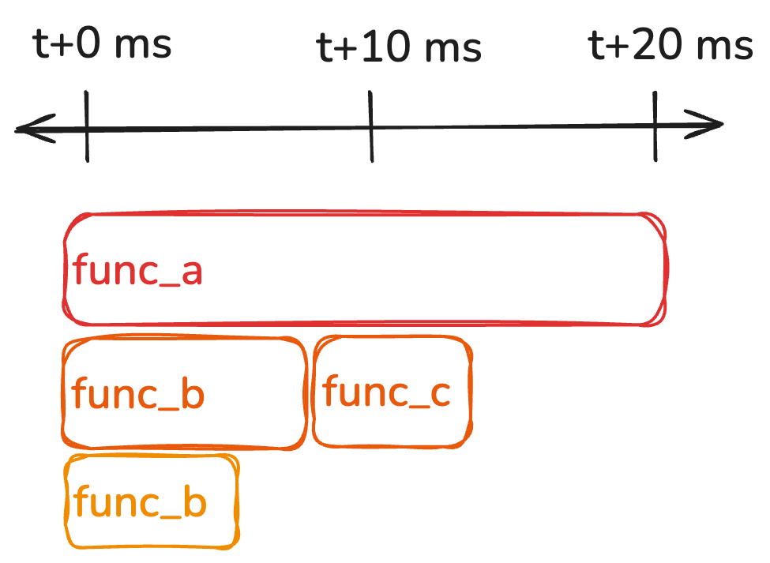

# Pyro Caml 🔥 🐪
Pyro Caml is a profiler for OCaml that works with
[Pyroscope](https://pyroscope.io/) for statistical continuous profiling purely
in user space.

# How it works
## Architecture
Pyro Caml work by generating samples consisting of OCaml callstacks within the
instrumented program. These samples are then written to a ring buffer via the
[OCaml Runtime Events tracing
system](https://ocaml.org/manual/5.3/runtime-tracing.html) introduce in OCaml 5.
Finally the Pyro Caml program, which is written in Rust in order to utilize
[pyroscope-rs](https://github.com/grafana/pyroscope-rs), uses ocaml-rs to read
from this ring buffer, process the callstacks, and then send the resulting
profile with metadata to a Pyroscope instance.

## Collecting and processing samples
Pyro Caml generates samples one of two ways, either via
[Memprof](https://ocaml.org/manual/5.3/api/Gc.Memprof.html) or by explicitly
emitting a sample. Memprof passes a callstack as a callback argument for any
allocation it samples, which is what's used to produce a sample in that case.
These callstacks get combined with metadata indicating when the sample was
taken, and which domain it was generated from, to form a sample. If the
resulting sample is too large to fit in a single runtime event, as there is a
1024 byte payload limit, they will be conditionally broken up into smaller
parts.

## CPU Profiling
On the Pyro Caml collector side, at regular intervals indicated by the sample
rate will read these samples. If it receives any sample parts it will recombine
them into a whole sample. We then choose a single sample from each domain, in
order to form a complete picture of the instrumented program's callstack at a
single moment in time.

Notably, we are reading samples that may not all occur at a single moment in
time. This means we cannot use the samples as is, as Memprof samples will be
weighted towards where the program allocates most, and manually emitted samples
will be weighted towards where the sample is emitted. To deal with this, we try
to generate as many samples as we can without introducing significant overhead.
This means for a given sample interval, we have many possible samples to choose
from, which allows us to choose a sample timestamped sufficiently close to the
single point in time we want to generate a complete callstack for. The downside
here is that for programs that don't emit many samples, we lose accuracy for
function calls that last less than the time of the sample interval.

Consider this example program, that we are sampling at a rate of 100 times a
second (the default for Pyro Caml):



Say we're sampling at time `t+10`. No matter where we generate a sample in for
the sample interval `[(t+0),(t+10)]` will include `func_a` in the callstack, as
the duration of `func_a` is greater than the sample interval. Assuming `func_c`
allocates sufficient memory and the Memprof sample rate is high enough, or it
explicitly emits a sample, it will generate a sample, meaning that this function
will also be included in the callstack. This means that although `func_c`'s
duration is shorter than `func_b`, we have generated a callstack that is
identical to a snapshot of the callstack at a single instant in time.

If `func_c` did not generate a sample, and `func_b` did, our callstack differs
from the callstack at a single instant in time, resulting in a less accurate
sample. Formal testing still needs to be done, but we've found that most OCaml
programs allocate enough that this case rarely happens, and functions that
rarely allocate can be modified to explicitly emit samples.

## Memory Profiling
Pyro Caml now also does memory profiling, supporting the following four profiles:
1. alloc_space: total memory allocated
2. alloc_objects: total number of allocated objects
3. inuse_space: currently live memory
4. inuse_objects: number of currently live objects

alloc_space/alloc_objects is built by estimating the total allocation from the samples. Memprof samples each allocated word independently with a small configurable probability. Dividing 

inuse_space/inuse_objects is built by keeping track of a live set of allocations and incrementing it upon allocation and decrementing it upon deallocation.

## Garbage Collector Profiling
The runtime events system provides us callbacks for the start and end of GC phases that allows us to build up a flame graph profile similar to cpu time.

# How to use
Pyro Caml consists of three parts, the instrumentation library, the profiler,
and a helpful PPX. The instrumentation and PPX libraries has no dependencies on
Rust, so it is able to be used like any other OCaml library. The library does
take a hard requirement on OCaml's new runtime event system introduced in OCaml
5, so is incompatible with older versions.

## Instrumentation Library
With the library installed, add it as a dependency to a dune file, preferably
the one defining the executable/entrypoint of the program:

```

(executable
 (package example-package)
 (name example)
 (public_name example)
 (libraries 
   ;...
   pyro-caml-instruments
   ;...
   )
 (modes exe))
```

Then enable the profiler, again preferably at the start of the program:

``` ocaml
let ()=
  Pyro_caml_instruments.maybe_with_memprof_sampler
  @@ fun () ->
  (* ... *)
```

from here the profiler will run, but it will only write profile samples to its
ring buffer if the OCaml Runtime events runtime tracing is enabled. This can be
done by either setting the environment variable `OCAML_RUNTIME_EVENTS_START` or
calling `Runtime_events.start`. If you are using the Pyro Caml binary, this will
be done for you. 

Note that this library uses the builtin OCaml profiling engine `Memprof`, and
may cause issues if you are using the profil

Now your program is instrumented and can be used with the profiler!

## Profiler
First obtain a `pyro-caml` binary, either via building it yourself (see
[Development](#development)), or soon, opam or the release page.

The profiler sends profiles via Pyroscope, so before we can do any profiling, we
first need a Pyroscope instance. There are two easy ways to do this, the first
is just running Pyroscope via Docker locally:

``` sh
docker run -it -p 4040:4040 grafana/pyroscope
```

Then in another terminal, you can run the profiler:

``` sh
pyro-caml --address "http://localhost:4040" --name "my_ocaml_program"  <BINARY> [ARGS_TO_BINARY]...
```

Now navigate to [localhost:4040](http://localhost:4040), and select the service
in the top left corner, and switch it to whatever you passed as the name
argument.

This version of Pyroscope is missing some nice things, like diffs between profile ranges, tags, etc. Pyroscope deployed via a Grafana instance is much more full featured.

To set this up with Grafana, follow [this
guide](https://grafana.com/docs/grafana/latest/datasources/pyroscope/configure-pyroscope-data-source/)
to first add Pyroscope as a datasource. For now Pyro Caml only supports basic
auth. Get the url, basic auth username and password, and then run the profiler:

``` sh
PYRO_CAML_BASIC_AUTH_USERNAME="username" PYRO_CAML_BASIC_AUTH_PASSWORD="password" pyro-caml --address "https://profiles-prod-008.grafana.net"  --name "my_ocaml_program"  <BINARY> [ARGS_TO_BINARY]...
```

## PPX
Since the instrumentation works via the memprof profiler, that means places with
low #s of allocations may not generate samples. We provide a PPX to
automatically annotate top level functions to explicitly emit samples.

To annotate all top level functions of all modules in a dune library:

```
 (preprocess
  (pps ppx_pyro_caml --auto))
```

If you wish to turn of the auto annotation for a section of code, add `[@@@pyro_profile "auto-off"]`.


If you don't want to annotate all modules, you can specify specific sections with:

``` ocaml
[@@@pyro_profile "auto-on"]

let f = ...

(* optionally turn it off *)
[@@@pyro_profile "auto-off"]
```

Finally, for more fine grain control, you can write:

``` ocaml
let f = ... [@@pyro_profile]
(* or say *)

let () =
  let[@pyro_profile] rec even n = (n = 0) || odd (n - 1)
  and[@pyro_profile] odd n = (n = 1) || n > 0 && even (n - 1)
  in Printf.printf "'six is even' is %b\n" (even 6)
```

# Development

## Opam

``` sh
make setup
```

This creates an OCaml switch with the necessary dependencies. Note that Rust is
required for building the `pyro-caml` binary, but not the OCaml library.

## Nix

``` sh
make shell
```

This will create a nix development shell

## Building

``` sh
make build # builds the pyro-caml binary for development
make build-release # builds a faster release version
```

# Releasing

Three steps: bump, tag, publish to opam.

## 1. Bump the version

Run the **bump-version** workflow (Actions tab → "bump-version" → "Run workflow") with the new version (e.g. `0.2.0`, no leading `v`). It opens a PR that:

- Updates the `(version ...)` stanza in `dune-project`.
- Rolls `CHANGES.md`: the existing `## unreleased` heading becomes `## vX.Y.Z (YYYY-MM-DD)` and a fresh empty `## unreleased` is added above.
- Regenerates the `*.opam` files.

Review and merge the PR. If you bumped any Rust deps recently, also refresh `vendor/` via `make vendor` and include it in the same branch — the `vendor/` tree must be committed so opam's offline sandbox can build.

## 2. Tag and push

```sh
git pull origin main
git tag v0.2.0
git push origin v0.2.0
```

The tag push triggers the `release` workflow, which builds `pyro-caml` binaries for `aarch64-apple-darwin`, `x86_64-apple-darwin`, `x86_64-unknown-linux-gnu`, and `aarch64-unknown-linux-gnu` and attaches them (with `.sha256` files) to a GitHub release.

## 3. Publish to opam-repository (local)

opam publishing is not done in CI — run it locally so the PR is opened under your own GitHub identity.

```sh
nix develop                                # or `make shell`
opam-publish https://github.com/semgrep/pyro-caml/releases/tag/v0.2.0
```

`opam-publish` will prompt for a GitHub token on first run and cache it under `~/.opam/plugins/opam-publish/`. The token needs `public_repo` scope (or `repo` for org-owned forks) and you must already have a fork of `ocaml/opam-repository`.

## Dry runs

The `release` workflow's `workflow_dispatch` trigger with `dry_run: true` (the default) builds the binaries and uploads them as workflow artifacts without creating a GitHub release.
